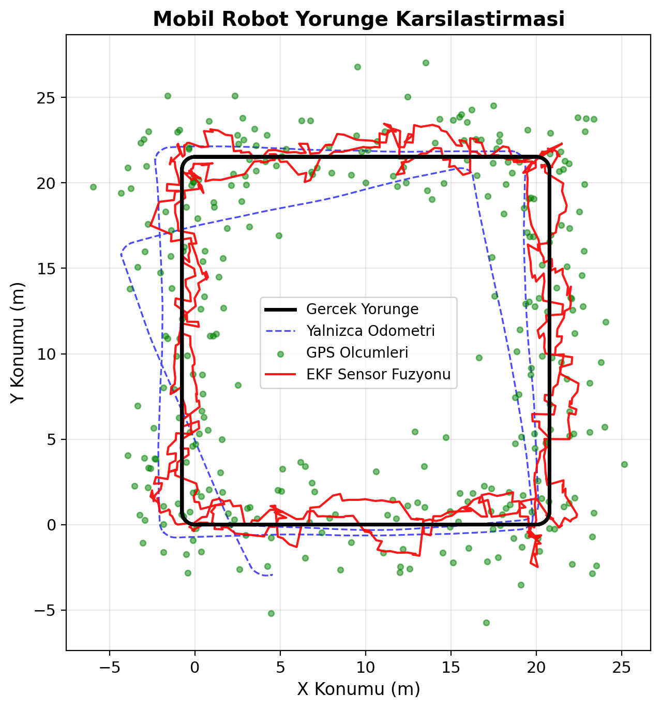
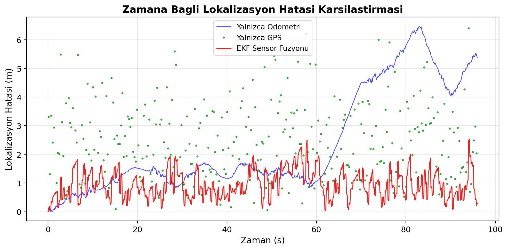
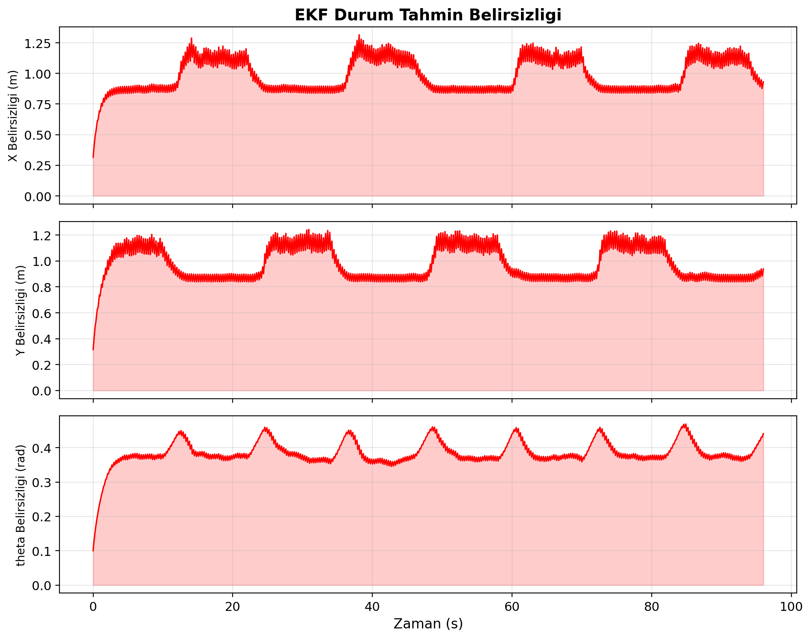
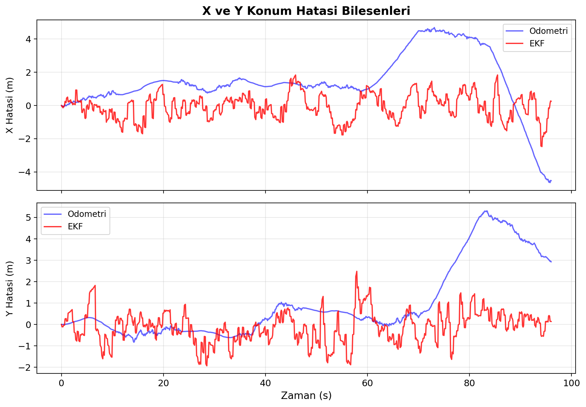
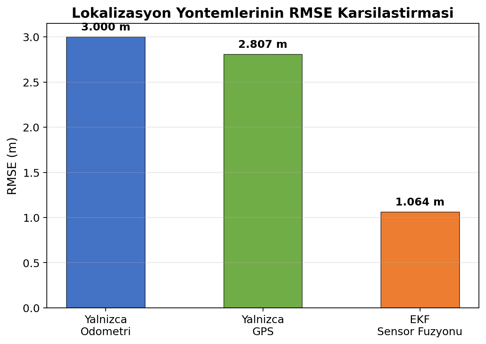

# Mobil Robot için Sensör Füzyonu ile Lokalizasyon Simülasyonu

## YZR502u05a01 - ÖDEV0501

Diferansiyel tahrikli bir mobil robotun lokalizasyonu için **Genişletilmiş Kalman Filtresi (EKF)** tabanlı sensör füzyon simülasyonu. Odometri ve GPS sensör verilerini birleştirerek, tek başına her iki sensöre kıyasla daha doğru konum tahmini elde edilmesini sağlar.

---

## Proje Yapısı

```
├── sensor_fusion_simulation.py   # Ana simülasyon kodu
├── rapor_sensor_fuzyon.docx      # Akademik rapor (Vancouver kaynakçalı)
├── sunum_sensor_fuzyon.pptx      # Sunum dosyası (8 slayt, 5-7 dk)
├── sekil1_yorunge_karsilastirma.png
├── sekil2_hata_karsilastirma.png
├── sekil3_ekf_belirsizlik.png
├── sekil4_xy_hata_bilesenleri.png
├── sekil5_rmse_karsilastirma.png
└── README.md
```

---

## Gereksinimler

- Python 3.8 veya üzeri
- NumPy
- Matplotlib

### Kurulum

```bash
pip install numpy matplotlib
```

---

## Çalıştırma

```bash
python sensor_fusion_simulation.py
```

Kod çalıştırıldığında:
1. Terminale performans metrikleri (RMSE, ortalama hata, maks. hata) yazdırılır
2. 5 adet grafik PNG dosyası olarak aynı klasöre kaydedilir

### Grafikleri Ekranda Görüntüleme

Varsayılan olarak grafikler sadece dosyaya kaydedilir. Ekranda da açılmasını istiyorsanız `sensor_fusion_simulation.py` dosyasında şu iki değişikliği yapın:

1. **Satır 8** → `matplotlib.use('Agg')` satırını silin veya başına `#` koyun
2. **Satır 262** → `plt.close('all')` yerine `plt.show()` yazın

---

## Simülasyon Açıklaması

### Robot Modeli
- **Tip:** Diferansiyel tahrikli mobil robot
- **Durum vektörü:** `[x, y, θ]` (konum + yönelim)
- **Kontrol girişi:** `[v, ω]` (lineer hız + açısal hız)
- **Hareket modeli:** Doğrusal olmayan kinematik model

### Sensörler

| Sensör | Ölçtüğü | Gürültü | Frekans |
|--------|---------|---------|---------|
| Odometri | Hız (v, ω) | σ_v=0.5 m/s, σ_ω=0.1 rad/s | 10 Hz |
| GPS | Konum (x, y) | σ=2.0 m | ~3.3 Hz |

### Algoritma
- **Genişletilmiş Kalman Filtresi (EKF)**
  - **Tahmin adımı:** Odometri verileriyle durum ve kovaryans tahmini (Jacobian ile doğrusallaştırma)
  - **Güncelleme adımı:** GPS ölçümleriyle Kalman kazancı hesabı ve durum düzeltmesi

### Yörünge
- Kare yol (20m kenar uzunluğu, 2 tur)
- Her köşede 90° dönüş

---

## Sonuçlar

| Metrik | Odometri | GPS | EKF Füzyon |
|--------|----------|-----|------------|
| Ortalama Hata (m) | 2.377 | 2.499 | **0.947** |
| Maks. Hata (m) | 6.473 | 6.402 | **2.536** |
| RMSE (m) | 3.000 | 2.807 | **1.064** |

- EKF iyileştirme (odometriye göre): **%64.5**
- EKF iyileştirme (GPS'e göre): **%62.1**

---

## Üretilen Grafikler

### Şekil 1 — Yörünge Karşılaştırması


### Şekil 2 — Zamana Bağlı Lokalizasyon Hatası


### Şekil 3 — EKF Belirsizlik Analizi


### Şekil 4 — X ve Y Hata Bileşenleri


### Şekil 5 — RMSE Karşılaştırması


---

## Parametrelerin Değiştirilmesi

Kodun üst kısmındaki parametreleri değiştirerek farklı senaryolar deneyebilirsiniz:

```python
# Gürültü parametreleri
sigma_v = 0.5         # Odometri hız gürültüsü (artırınca odometri kötüleşir)
sigma_omega = 0.1     # Odometri açısal hız gürültüsü
sigma_gps_x = 2.0     # GPS x-gürültüsü (artırınca GPS kötüleşir)
sigma_gps_y = 2.0     # GPS y-gürültüsü

# EKF parametreleri (generate_square_trajectory fonksiyonu sonrası)
Q = np.diag([0.05, 0.05, 0.005])   # Süreç gürültüsü kovaryansı
R = np.diag([sigma_gps_x**2, ...]) # Ölçüm gürültüsü kovaryansı
gps_period = 3                      # GPS güncelleme sıklığı (her N adımda bir)
```

---

## Kaynaklar

1. Thrun S, Burgard W, Fox D. *Probabilistic Robotics.* MIT Press; 2005.
2. Siciliano B, Khatib O. *Springer Handbook of Robotics.* 2nd ed. Springer; 2016.
3. Borenstein J, et al. Mobile robot positioning: Sensors and techniques. *J Robotic Systems* 1997; 14(4): 231-249.
4. Farrell JA, Barth M. *The Global Positioning System and Inertial Navigation.* McGraw-Hill; 1999.
5. Simon D. *Optimal State Estimation.* Wiley; 2006.
6. Ristic B, et al. *Beyond the Kalman Filter.* Artech House; 2004.
7. Welch G, Bishop G. An Introduction to the Kalman Filter. UNC Chapel Hill, TR 95-041; 2006.
8. Choset H, et al. *Principles of Robot Motion.* MIT Press; 2005.

---

## Lisans

Bu proje YZR502u05a01 dersi kapsamında akademik amaçlı hazırlanmıştır.
